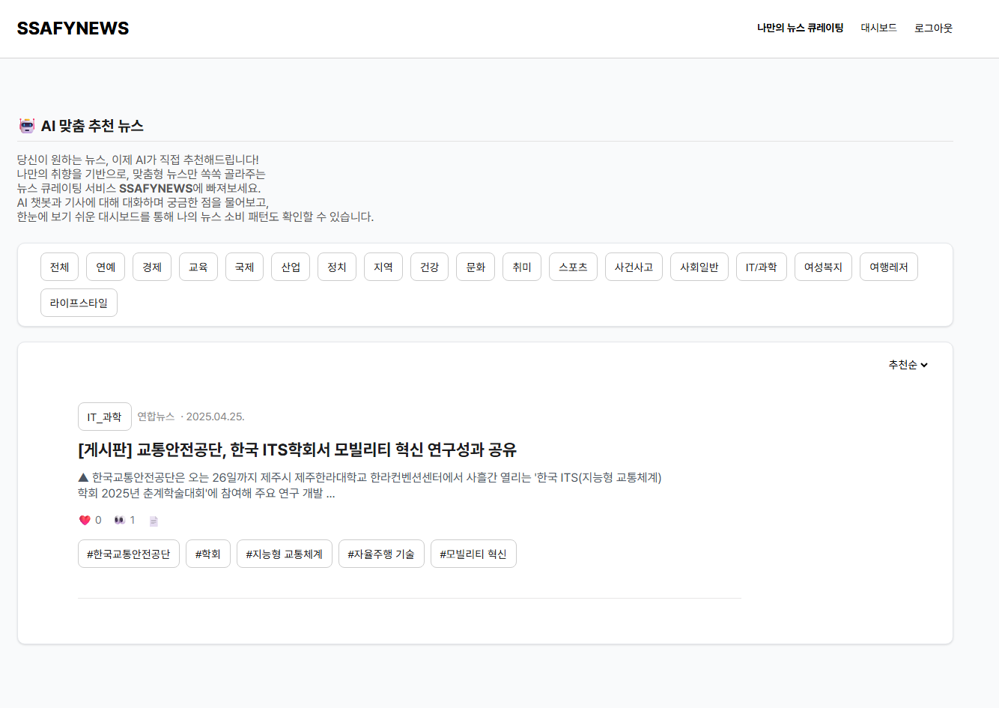
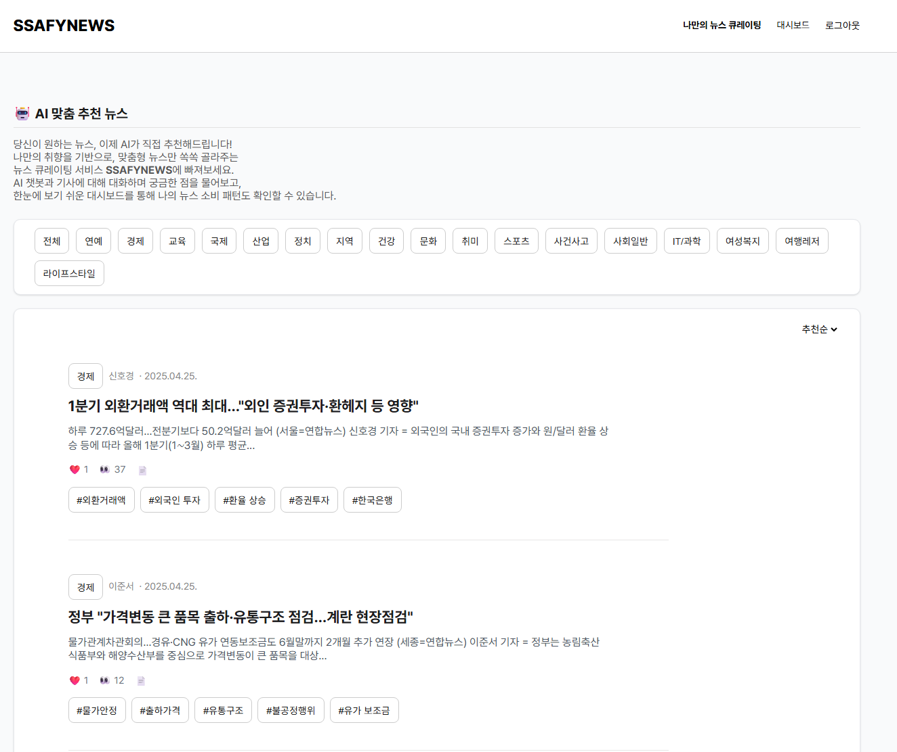
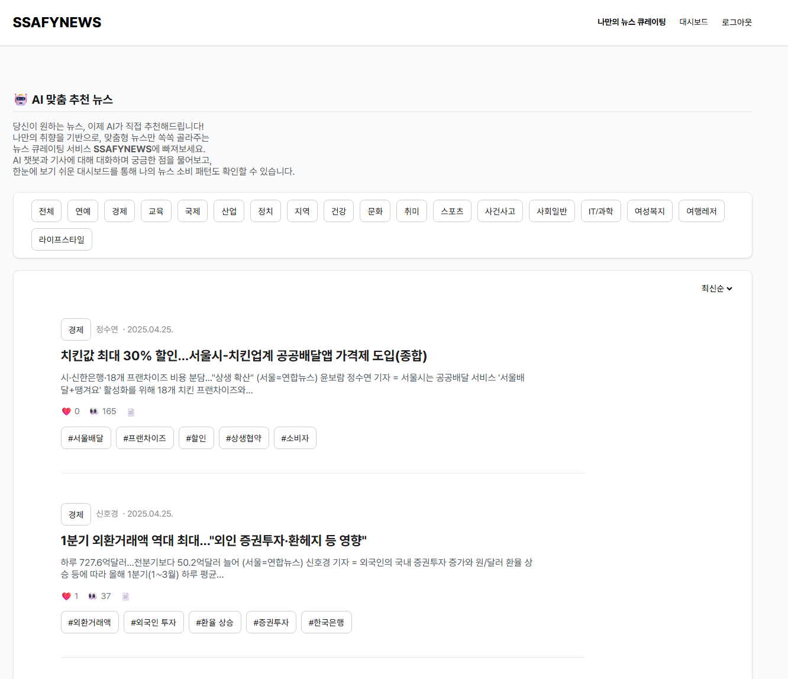
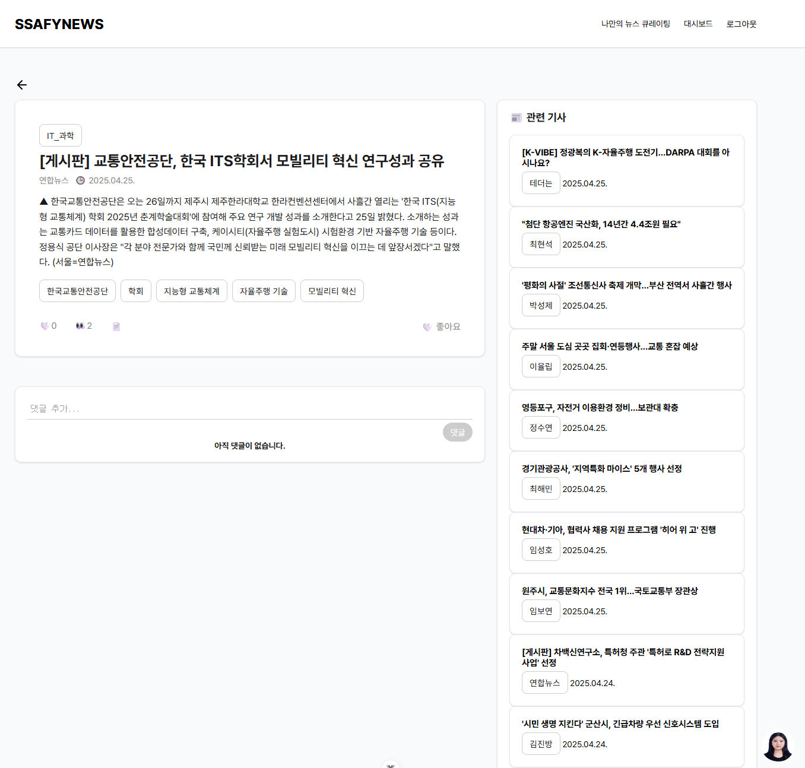
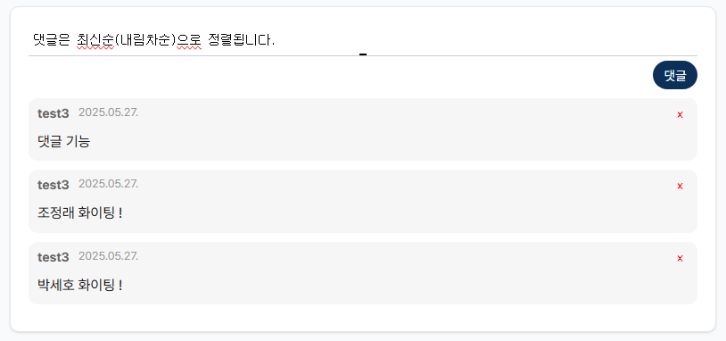
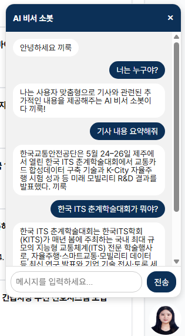
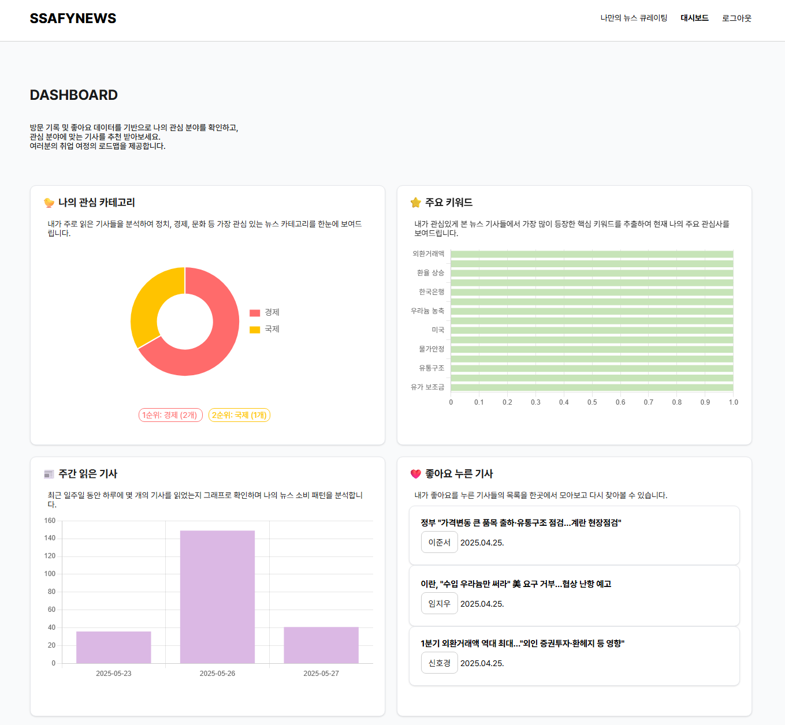

# SSAFYNEWS
- **AI 맞춤 뉴스 추천**  
  카테고리별, 최신순/추천순 필터 제공  

- **뉴스 상세 페이지**  
  기사 '좋아요' 저장, 관련 뉴스 사이드바 제공  

- **대시보드**  
  사용자 활동 시각화: 관심 카테고리, 주요 키워드, 주간 기사 수, 좋아요한 뉴스 등  

---

## 실행 가이드

```bash
npm install

npm run dev
```

---

## 프로젝트 구조

```
FRONTEND/
├── public/
├── src/
│   ├── assets/
│   ├── components/
│   ├── views/
│   ├── router/
│   └── store/
├── package.json
└── vite.config.js
```

---

### Front-end
- main page `/news`
  - NewsView.vue
    기사 리스트를 보여주는 component

    - 카테고리 별   
       

    - 추천순   
       

    - 최신순   
    
    사용자가 원하는 방식으로 기사 리스트 조회 가능

- detail news page `/news/<int: news_id>`   
     

  - 뉴스에 대한 자세한 정보 보여주는 component `NewsDetailView.vue`
  - 관련 기사 리스트 제공 `ArticlePreview.vue`
  - 댓글 기능 추가 `CommentBox.vue`   
     

  - 해당 뉴스 기사에 대해 다양한 정보를 제공해주는 챗봇 추가 (모달 형식) `Chatbot.vue`   
  
   
- dashboard `/dashboard`   
  
  - 나의 관심 카테고리
  - 내가 본 기사들의 키워드 통계
  - 주간 읽은 기사의 수
  - 좋아요를 누른 기사
  확인 가능